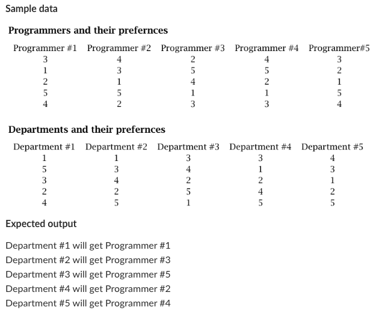
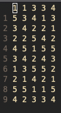

# Department & Programmer matching project
This project is an example of the classic stable marriage problem which utilizes the Gale-Shapley algorithm to solve which programmer should be
assigned to which department based on given preferences for each department and programmer.

## Sample Input and output

## How to run
In order to run this program you need to provide an input file similarly formatted to matching-data.txt seen below

There needs to be 2*n by n numbers in the file, the first n rows represent the preference levels of the departments
The bottom n rows should represent the preference levels of the programmers. Each column represents the individual department or programmer.
In the example image above where n = 5, the first 5 rows of the first column represent the preference levels (high to low) of Department #1, the
numbers themselves represent the Programmer #. Preference level would be as follows: Programmer 1 (highest priority), Prog 5, Prog 3, Prog 2, Prog 4 (Lowest Priority)

> Protects against invalid filename but **NOT INVALID n VALUES**

You should know the correct value for n before using this program.

